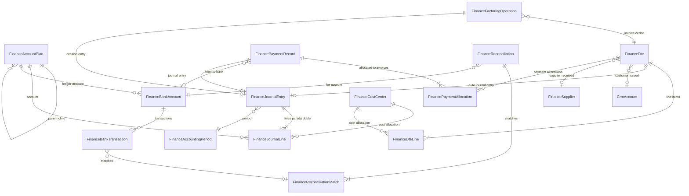

# Diseno del Modulo ERP Financiero-Contable para Opai

**Fecha:** 2026-02-15
**Estado:** Aprobado
**Autor:** Claude (brainstorming session)

---

## 1. Contexto del Proyecto

### 1.1 Stack Tecnologico

| Aspecto | Tecnologia |
|---------|-----------|
| Framework | Next.js 15 (App Router) + TypeScript 5.6 |
| Base de datos | PostgreSQL (Neon serverless), 8 schemas |
| ORM | Prisma 6.x |
| Auth | Auth.js v5 (NextAuth), credentials + JWT |
| UI | Tailwind CSS + Radix UI + shadcn/ui |
| PDF | @react-pdf/renderer + Playwright |
| Email | Resend + React Email |
| Almacenamiento | Cloudflare R2 |
| Deploy | Vercel |
| AI | OpenAI (GPT) + pgvector (RAG) |

### 1.2 Arquitectura Actual

- Monolito modular (Next.js full-stack con App Router)
- Multi-tenant estricto: `tenantId` en cada tabla
- 8 schemas PostgreSQL: public, crm, cpq, docs, payroll, fx, ops, finance
- 105+ modelos Prisma, 70+ migraciones
- 219+ endpoints REST (rutas API Next.js)
- 13 roles RBAC con permisos granulares

### 1.3 Modulos en Produccion

1. **Hub** - Dashboard ejecutivo
2. **CRM** - Leads, cuentas, contactos, deals, pipeline, emails (Gmail)
3. **CPQ** - Cotizaciones con motor de costos laborales
4. **Presentaciones** - Propuestas comerciales con tracking
5. **Documentos** - Templates, firmas digitales, versionado
6. **Payroll** - Simulador de liquidaciones chilenas (AFP, salud, impuestos)
7. **FX** - Tasas UF/UTM automaticas (SBIF/SII)
8. **OPS** - Guardias, pauta mensual, asistencia, turnos extra, rondas, control nocturno, marcacion
9. **Finanzas** - Rendiciones de gastos, viajes km, aprobaciones, pagos Santander

### 1.4 Lo que YA existe en finanzas

- Rendiciones de gastos (compras y kilometraje)
- Centros de costo (FinanceCostCenter)
- Aprobacion multi-nivel (FinanceApproval)
- Exportacion bancaria Santander (formato ABM)
- Tasas UF/UTM sincronizadas (schema fx)
- 9 modelos Prisma en schema `finance`

### 1.5 Lo que NO existe (alcance de este diseno)

- Plan de cuentas contable
- Libro diario/mayor (partida doble)
- Emision de DTE (facturas electronicas SII)
- Recepcion de facturas de proveedores
- Cuentas por cobrar / por pagar
- Conciliacion bancaria
- Conexion bancaria (Fintoc u otra API)
- Factoring
- Reporteria tributaria (F29, libros compra/venta)

---

## 2. Decisiones de Diseno

| Decision | Eleccion | Razon |
|----------|----------|-------|
| Schema DB | Extender schema `finance` existente | Menos joins cross-schema, consistente con la decision del usuario |
| Organizacion codigo | Sub-modulos cohesivos dentro de finance | Patron similar a OPS (29 modelos en un schema, codigo en carpetas por feature) |
| Proveedor DTE | Adapter pattern, optimizado para APIs tipo FACTO | Permite cambiar proveedor sin tocar logica de negocio |
| Conexion bancaria | Manual (CSV/Excel) primero, adapter para API despues | Reduce dependencia inicial de terceros |
| Plan de cuentas | Plan base chileno + personalizacion por tenant | Balance entre estandar y flexibilidad |
| Factoring | Flujo interno primero, API despues | Permite usar sin contrato de factoring previo |

---

## 3. Estructura de Carpetas

```
src/
  modules/finance/
    accounting/
      account-plan.service.ts      # CRUD plan de cuentas, seed base chileno
      journal-entry.service.ts     # Crear/contabilizar/reversar asientos
      period.service.ts            # Apertura/cierre periodos
      ledger.service.ts            # Libro mayor por cuenta
      auto-entry.builder.ts        # Construye asientos automaticos desde eventos
    billing/
      dte-issuer.service.ts        # Emision de DTE (facturas, boletas, NC, ND, guias)
      dte-receiver.service.ts      # Recepcion y aceptacion/reclamo DTE
      dte-pdf.service.ts           # Generacion PDF del DTE
      dte-email.service.ts         # Envio por email al receptor
      folio.service.ts             # Gestion de timbraje/folios
    treasury/
      bank-account.service.ts      # CRUD cuentas bancarias empresa
      bank-sync.service.ts         # Sincronizacion movimientos (API o CSV)
      bank-import.service.ts       # Importacion manual cartolas (CSV/Excel)
      cash-register.service.ts     # Gestion cajas efectivo
    reconciliation/
      reconciliation.service.ts    # Crear/gestionar periodos de conciliacion
      auto-matcher.service.ts      # Match automatico monto+fecha+referencia
      manual-matcher.service.ts    # Match manual y ajustes
    receivables/
      receivables.service.ts       # Cuentas por cobrar: listado, antiguedad
      collection.service.ts        # Registro de cobros (parciales/totales)
      alerts.service.ts            # Alertas de vencimiento
    payables/
      payables.service.ts          # Cuentas por pagar: listado, vencimientos
      disbursement.service.ts      # Registro de pagos a proveedores
      supplier.service.ts          # CRUD proveedores
    factoring/
      factoring.service.ts         # Simulacion, registro cesion, seguimiento
      cession.service.ts           # Registro cesion en SII (futuro API)
    reports/
      balance-sheet.service.ts     # Balance General
      income-statement.service.ts  # Estado de Resultados
      purchase-ledger.service.ts   # Libro de Compras (IECV)
      sales-ledger.service.ts      # Libro de Ventas (IECV)
      f29-proposal.service.ts      # Propuesta F29
      cash-flow.service.ts         # Flujo de Caja
      aging.service.ts             # Antiguedad de saldos
      account-statement.service.ts # Estado de cuenta cliente/proveedor
      export.service.ts            # Exportacion PDF/Excel generica
    shared/
      adapters/
        dte-provider.adapter.ts        # Interface para proveedor DTE
        facto.adapter.ts               # Implementacion FACTO
        simple-factura.adapter.ts      # Implementacion SimpleFactura (futuro)
        bank-provider.adapter.ts       # Interface para proveedor bancario
        fintoc.adapter.ts              # Implementacion Fintoc (futuro)
        manual-bank.adapter.ts         # Implementacion manual/CSV
        factoring-provider.adapter.ts  # Interface para factoring API
      constants/
        chart-of-accounts-cl.ts    # Plan de cuentas base chileno (seed)
        dte-types.ts               # Tipos DTE SII
        tax-codes.ts               # Codigos tributarios
      validators/
        rut.validator.ts           # Validacion RUT chileno
        dte.validator.ts           # Validacion campos DTE
        journal.validator.ts       # Validacion partida doble (debitos = creditos)
      types/
        accounting.types.ts
        billing.types.ts
        treasury.types.ts
        reports.types.ts
    jobs/
      sync-bank-transactions.ts    # Cron: sincronizar movimientos bancarios
      sync-received-dte.ts         # Cron: consultar DTE recibidos
      check-dte-status.ts          # Cron: verificar estado DTE en SII
      payment-due-alerts.ts        # Cron: alertas de vencimiento
      reception-deadline-alerts.ts # Cron: alertas 8 dias reclamo DTE

  app/
    (app)/finanzas/
      contabilidad/                # UI: Plan de cuentas, asientos, libros
      facturacion/                 # UI: Emision DTE
      compras/                     # UI: Recepcion facturas proveedores
      tesoreria/                   # UI: Cuentas bancarias, cartolas
      conciliacion/                # UI: Match bancario vs sistema
      cobranza/                    # UI: Cuentas por cobrar
      pagos/                       # UI: Cuentas por pagar
      factoring/                   # UI: Cesion de facturas
      reportes/                    # UI: Balance, EERR, F29, libros
    api/finance/
      accounting/                  # Endpoints contabilidad
      billing/                     # Endpoints facturacion
      purchases/                   # Endpoints compras
      treasury/                    # Endpoints tesoreria
      reconciliation/              # Endpoints conciliacion
      receivables/                 # Endpoints cobranza
      payables/                    # Endpoints pagos
      factoring/                   # Endpoints factoring
      reports/                     # Endpoints reporteria
      config/                      # Endpoints configuracion
```

---

## 4. Modelo de Datos

Todas las tablas en schema `finance`. Prefijo `Finance` en Prisma.
Cada tabla tiene `tenantId` obligatorio (multi-tenant).

### 4.1 Plan de Cuentas y Contabilidad

#### FinanceAccountPlan

| Campo | Tipo | Descripcion |
|-------|------|-------------|
| id | String @id @default(cuid()) | PK |
| tenantId | String | FK Tenant |
| code | String | Codigo jerarquico (ej: 1.1.01.001) |
| name | String | Nombre cuenta |
| type | Enum(ASSET, LIABILITY, EQUITY, REVENUE, COST, EXPENSE) | Clasificacion |
| nature | Enum(DEBIT, CREDIT) | Naturaleza del saldo |
| parentId | String? | FK self (jerarquico) |
| level | Int | 1=grupo, 2=subgrupo, 3=cuenta, 4=subcuenta |
| isSystem | Boolean | Cuentas base no editables |
| isActive | Boolean | Si acepta uso |
| acceptsEntries | Boolean | Solo cuentas hoja reciben asientos |
| description | String? | |
| taxCode | String? | Codigo SII si aplica |
| createdAt, updatedAt | DateTime | |

Constraints: `@@unique([tenantId, code])`

#### FinanceAccountingPeriod

| Campo | Tipo | Descripcion |
|-------|------|-------------|
| id | String @id | PK |
| tenantId | String | FK Tenant |
| year | Int | |
| month | Int | 1-12, o 0 para anual |
| startDate | DateTime | |
| endDate | DateTime | |
| status | Enum(OPEN, CLOSED, LOCKED) | |
| closedBy | String? | FK Admin |
| closedAt | DateTime? | |

Constraints: `@@unique([tenantId, year, month])`

#### FinanceJournalEntry

| Campo | Tipo | Descripcion |
|-------|------|-------------|
| id | String @id | PK |
| tenantId | String | FK Tenant |
| number | Int | Autoincremental por tenant+ano |
| date | DateTime | |
| periodId | String | FK FinanceAccountingPeriod |
| description | String | |
| reference | String? | Ej: FAC-2026-00123 |
| sourceType | Enum(MANUAL, INVOICE_ISSUED, INVOICE_RECEIVED, PAYMENT, RECONCILIATION, FACTORING, EXPENSE_REPORT, OPENING, CLOSING) | |
| sourceId | String? | FK polimorfico al documento origen |
| status | Enum(DRAFT, POSTED, REVERSED) | |
| reversedById | String? | FK self |
| costCenterId | String? | FK FinanceCostCenter |
| totalDebit | Decimal(14,2) | |
| totalCredit | Decimal(14,2) | |
| createdBy | String | FK Admin |
| postedBy | String? | FK Admin |
| postedAt | DateTime? | |

Indices: `[tenantId, date]`, `[tenantId, sourceType, sourceId]`

#### FinanceJournalLine

| Campo | Tipo | Descripcion |
|-------|------|-------------|
| id | String @id | PK |
| entryId | String | FK FinanceJournalEntry |
| accountId | String | FK FinanceAccountPlan |
| description | String? | |
| debit | Decimal(14,2) | Default 0 |
| credit | Decimal(14,2) | Default 0 |
| costCenterId | String? | FK FinanceCostCenter |
| thirdPartyId | String? | FK polimorfico: cliente o proveedor |
| thirdPartyType | Enum?(CUSTOMER, SUPPLIER) | |

Indices: `[accountId]`, `[entryId]`

### 4.2 Facturacion (Emision y Recepcion DTE)

#### FinanceSupplier

| Campo | Tipo | Descripcion |
|-------|------|-------------|
| id | String @id | PK |
| tenantId | String | FK Tenant |
| rut | String | RUT proveedor |
| name | String | Razon social |
| tradeName | String? | Nombre fantasia |
| address | String? | |
| commune | String? | |
| city | String? | |
| email | String? | |
| phone | String? | |
| contactName | String? | |
| paymentTermDays | Int | Default 30 |
| accountPayableId | String? | FK FinanceAccountPlan (cuenta por pagar) |
| accountExpenseId | String? | FK FinanceAccountPlan (cuenta gasto default) |
| isActive | Boolean | Default true |

Constraints: `@@unique([tenantId, rut])`

#### FinanceDte

| Campo | Tipo | Descripcion |
|-------|------|-------------|
| id | String @id | PK |
| tenantId | String | FK Tenant |
| direction | Enum(ISSUED, RECEIVED) | |
| dteType | Int | 33=Factura, 34=Exenta, 39=Boleta, 52=Guia, 61=NC, 56=ND |
| folio | Int | |
| code | String | Codigo interno (ej: FAC-2026-00001) |
| date | DateTime | Fecha emision |
| dueDate | DateTime? | Fecha vencimiento |
| issuerRut | String | |
| issuerName | String | |
| receiverRut | String | |
| receiverName | String | |
| receiverEmail | String? | |
| referenceDteId | String? | FK self (para NC/ND) |
| referenceType | Int? | Tipo DTE referenciado |
| referenceFolio | Int? | |
| referenceReason | String? | |
| currency | Enum(CLP, USD, UF) | Default CLP |
| exchangeRate | Decimal(10,4)? | |
| netAmount | Decimal(14,2) | Neto |
| exemptAmount | Decimal(14,2) | Exento, default 0 |
| taxRate | Decimal(5,2) | Default 19.00 |
| taxAmount | Decimal(14,2) | IVA |
| totalAmount | Decimal(14,2) | Total |
| accountId | String? | FK CrmAccount (si emitida a cliente) |
| contactId | String? | FK CrmContact |
| supplierId | String? | FK FinanceSupplier (si recibida) |
| siiStatus | Enum(PENDING, SENT, ACCEPTED, REJECTED, WITH_OBJECTIONS, ANNULLED) | |
| siiTrackId | String? | ID tracking del proveedor API |
| siiResponse | Json? | Respuesta completa del SII |
| siiAcceptedAt | DateTime? | |
| receptionStatus | Enum?(PENDING_REVIEW, ACCEPTED, CLAIMED, PARTIAL_CLAIM, EXPIRED) | Solo recibidas |
| receptionDeadline | DateTime? | 8 dias habiles |
| receptionDecidedAt | DateTime? | |
| receptionDecidedBy | String? | |
| claimType | Int? | Codigo reclamo SII |
| pdfUrl | String? | URL en R2 |
| xmlUrl | String? | URL en R2 |
| cedible | Boolean | Default false |
| journalEntryId | String? | FK FinanceJournalEntry |
| paymentStatus | Enum(UNPAID, PARTIAL, PAID, OVERDUE, WRITTEN_OFF) | |
| amountPaid | Decimal(14,2) | Default 0 |
| amountPending | Decimal(14,2) | = totalAmount - amountPaid |
| notes | String? | |
| createdBy | String | FK Admin |

Constraints: `@@unique([tenantId, direction, dteType, folio])`
Indices: `[tenantId, direction, paymentStatus]`, `[tenantId, accountId]`, `[tenantId, supplierId]`

#### FinanceDteLine

| Campo | Tipo | Descripcion |
|-------|------|-------------|
| id | String @id | PK |
| dteId | String | FK FinanceDte |
| lineNumber | Int | |
| itemCode | String? | |
| itemName | String | |
| description | String? | |
| quantity | Decimal(12,4) | |
| unit | String? | UN, HRS, KG |
| unitPrice | Decimal(14,4) | |
| discountPct | Decimal(5,2) | Default 0 |
| netAmount | Decimal(14,2) | |
| isExempt | Boolean | Default false |
| accountId | String? | FK FinanceAccountPlan (cuenta ingreso/gasto) |
| costCenterId | String? | FK FinanceCostCenter |

### 4.3 Tesoreria y Bancos

#### FinanceBankAccount

| Campo | Tipo | Descripcion |
|-------|------|-------------|
| id | String @id | PK |
| tenantId | String | FK Tenant |
| bankCode | String | SANTANDER, BCHILE, BCI, etc |
| bankName | String | |
| accountType | Enum(CHECKING, SAVINGS, VISTA) | |
| accountNumber | String | |
| currency | Enum(CLP, USD, UF) | Default CLP |
| holderName | String | Nombre titular |
| holderRut | String | |
| accountPlanId | String? | FK FinanceAccountPlan |
| isActive | Boolean | Default true |
| isDefault | Boolean | Default false |
| apiProvider | String? | FINTOC, MANUAL |
| apiLinkId | String? | |
| apiAccountId | String? | |
| apiLastSync | DateTime? | |
| currentBalance | Decimal(14,2)? | |
| balanceUpdatedAt | DateTime? | |

Constraints: `@@unique([tenantId, bankCode, accountNumber])`

#### FinanceBankTransaction

| Campo | Tipo | Descripcion |
|-------|------|-------------|
| id | String @id | PK |
| tenantId | String | FK Tenant |
| bankAccountId | String | FK FinanceBankAccount |
| transactionDate | DateTime | |
| valueDate | DateTime? | Fecha valor |
| description | String | Glosa del banco |
| reference | String? | Nro operacion |
| amount | Decimal(14,2) | Positivo=abono, negativo=cargo |
| balance | Decimal(14,2)? | Saldo despues del movimiento |
| category | String? | Categorizacion automatica o manual |
| source | Enum(API, MANUAL, CSV_IMPORT) | |
| apiTransactionId | String? | ID del proveedor API |
| reconciliationStatus | Enum(UNMATCHED, MATCHED, RECONCILED, EXCLUDED) | |
| reconciliationId | String? | FK FinanceReconciliation |

Constraints: `@@unique([tenantId, bankAccountId, apiTransactionId])`
Indices: `[tenantId, bankAccountId, transactionDate]`, `[reconciliationStatus]`

#### FinanceCashRegister

| Campo | Tipo | Descripcion |
|-------|------|-------------|
| id | String @id | PK |
| tenantId | String | FK Tenant |
| name | String | Ej: Caja Chica Oficina Central |
| accountPlanId | String? | FK FinanceAccountPlan |
| currentBalance | Decimal(14,2) | Default 0 |
| isActive | Boolean | Default true |

Constraints: `@@unique([tenantId, name])`

### 4.4 Pagos y Conciliacion

#### FinancePaymentRecord

| Campo | Tipo | Descripcion |
|-------|------|-------------|
| id | String @id | PK |
| tenantId | String | FK Tenant |
| code | String | PAG-2026-00001 |
| type | Enum(COLLECTION, DISBURSEMENT) | Cobro vs pago |
| date | DateTime | |
| amount | Decimal(14,2) | |
| currency | Enum(CLP, USD, UF) | Default CLP |
| exchangeRate | Decimal(10,4)? | |
| paymentMethod | Enum(TRANSFER, CHECK, CASH, CREDIT_CARD, FACTORING, COMPENSATION, OTHER) | |
| bankAccountId | String? | FK FinanceBankAccount |
| cashRegisterId | String? | FK FinanceCashRegister |
| checkNumber | String? | |
| transferReference | String? | |
| accountId | String? | FK CrmAccount (si es cobro) |
| supplierId | String? | FK FinanceSupplier (si es pago) |
| journalEntryId | String? | FK FinanceJournalEntry |
| status | Enum(PENDING, CONFIRMED, CANCELLED) | |
| notes | String? | |
| createdBy | String | |

Indices: `[tenantId, type, date]`

#### FinancePaymentAllocation

| Campo | Tipo | Descripcion |
|-------|------|-------------|
| id | String @id | PK |
| paymentId | String | FK FinancePaymentRecord |
| dteId | String | FK FinanceDte |
| amount | Decimal(14,2) | Monto asignado a esta factura |

Indices: `[paymentId]`, `[dteId]`

#### FinanceReconciliation

| Campo | Tipo | Descripcion |
|-------|------|-------------|
| id | String @id | PK |
| tenantId | String | FK Tenant |
| bankAccountId | String | FK FinanceBankAccount |
| periodYear | Int | |
| periodMonth | Int | |
| status | Enum(IN_PROGRESS, COMPLETED, APPROVED) | |
| bankBalance | Decimal(14,2) | Saldo segun banco |
| bookBalance | Decimal(14,2) | Saldo segun libros |
| difference | Decimal(14,2) | Diferencia |
| completedBy | String? | |
| completedAt | DateTime? | |
| approvedBy | String? | |
| approvedAt | DateTime? | |

Constraints: `@@unique([tenantId, bankAccountId, periodYear, periodMonth])`

#### FinanceReconciliationMatch

| Campo | Tipo | Descripcion |
|-------|------|-------------|
| id | String @id | PK |
| reconciliationId | String | FK FinanceReconciliation |
| bankTransactionId | String | FK FinanceBankTransaction |
| paymentRecordId | String? | FK FinancePaymentRecord |
| journalEntryId | String? | FK FinanceJournalEntry |
| matchType | Enum(AUTO, MANUAL) | |
| matchConfidence | Decimal(5,2)? | 0-100 para auto |
| createdBy | String? | |

### 4.5 Factoring

#### FinanceFactoringOperation

| Campo | Tipo | Descripcion |
|-------|------|-------------|
| id | String @id | PK |
| tenantId | String | FK Tenant |
| code | String | FACT-2026-00001 |
| dteId | String | FK FinanceDte (factura cedida) |
| factoringCompany | String | Nombre empresa de factoring |
| invoiceAmount | Decimal(14,2) | Monto factura |
| advanceRate | Decimal(5,2) | % anticipo |
| advanceAmount | Decimal(14,2) | Monto anticipado |
| interestRate | Decimal(6,4) | Tasa interes |
| interestAmount | Decimal(14,2) | |
| commissionAmount | Decimal(14,2) | |
| netAdvance | Decimal(14,2) | Lo que recibe la empresa |
| retentionAmount | Decimal(14,2) | Retencion hasta cobro |
| status | Enum(SIMULATED, SUBMITTED, APPROVED, FUNDED, COLLECTED, CANCELLED) | |
| submittedAt | DateTime? | |
| fundedAt | DateTime? | |
| collectedAt | DateTime? | |
| cessionRegistered | Boolean | Default false |
| cessionDate | DateTime? | |
| cessionSiiStatus | String? | |
| journalEntryId | String? | FK FinanceJournalEntry (asiento cesion) |
| collectionEntryId | String? | FK FinanceJournalEntry (asiento cobro retencion) |
| notes | String? | |
| createdBy | String | |

### 4.6 Auditoria

#### FinanceAuditLog

| Campo | Tipo | Descripcion |
|-------|------|-------------|
| id | String @id | PK |
| tenantId | String | FK Tenant |
| userId | String | |
| userName | String | |
| action | String | JOURNAL_POSTED, DTE_ISSUED, PERIOD_CLOSED, etc |
| entityType | String | FinanceDte, FinanceJournalEntry, etc |
| entityId | String | |
| previousData | Json? | |
| newData | Json? | |
| ipAddress | String? | |
| createdAt | DateTime | |

Indices: `[tenantId, entityType, entityId]`, `[tenantId, createdAt]`

### 4.7 Diagrama de Relaciones



---

## 5. Adapter Pattern para APIs Externas

### 5.1 Interface Proveedor DTE

```typescript
interface DteProviderAdapter {
  // Emision
  issueDte(params: IssueDteParams): Promise<IssueDteResult>
  getDteStatus(trackId: string): Promise<DteStatusResult>
  getDtePdf(trackId: string): Promise<Buffer>
  voidDte(trackId: string, reason: string): Promise<VoidResult>

  // Folios
  getAvailableFolios(dteType: number): Promise<FolioInfo>

  // Recepcion
  getReceivedDtes(dateRange: DateRange): Promise<ReceivedDte[]>
  acceptDte(siiTrackId: string): Promise<AcceptResult>
  claimDte(siiTrackId: string, claimType: number): Promise<ClaimResult>

  // Cesion (factoring)
  registerCession(params: CessionParams): Promise<CessionResult>
}
```

### 5.2 Interface Proveedor Bancario

```typescript
interface BankProviderAdapter {
  getAccounts(): Promise<BankAccountInfo[]>
  getTransactions(accountId: string, dateRange: DateRange): Promise<BankTx[]>
  getBalance(accountId: string): Promise<BalanceInfo>
}
```

### 5.3 Seleccion de Adapter

```typescript
function getDteProvider(tenantId: string): DteProviderAdapter {
  const config = await getProviderConfig(tenantId)
  switch (config.provider) {
    case 'FACTO': return new FactoAdapter(config.credentials)
    case 'SIMPLE_FACTURA': return new SimpleFacturaAdapter(config.credentials)
    default: throw new Error(`Unknown DTE provider: ${config.provider}`)
  }
}

function getBankProvider(tenantId: string): BankProviderAdapter {
  const config = await getBankProviderConfig(tenantId)
  switch (config.provider) {
    case 'FINTOC': return new FintocAdapter(config.credentials)
    case 'MANUAL': return new ManualBankAdapter()
    default: return new ManualBankAdapter()
  }
}
```

---

## 6. Asientos Automaticos

Cada operacion financiera genera su asiento contable a traves de `auto-entry.builder.ts`:

| Evento | Debe | Haber |
|--------|------|-------|
| Factura emitida (venta) | Deudores por Venta | Ingreso por Venta + IVA Debito Fiscal |
| Factura exenta emitida | Deudores por Venta | Ingreso Exento |
| Nota de credito emitida | (reversa del asiento de la factura original) | |
| Factura recibida (compra) | Gasto o Activo + IVA Credito Fiscal | Proveedores |
| Pago a proveedor | Proveedores | Banco |
| Cobro de cliente | Banco | Deudores por Venta |
| Rendicion de gasto (existente) | Gasto | Caja o Banco |
| Cesion factoring | Banco + Gasto Financiero + Retencion | Deudores por Venta |
| Cobro retencion factoring | Banco | Retencion Factoring |
| Apertura periodo | Resultados Acumulados | Cuentas de resultado |
| Cierre periodo | Cuentas resultado | Resultado del Ejercicio |

### Tipo de eventos

```typescript
type AutoEntryEvent =
  | { type: 'INVOICE_ISSUED'; dte: FinanceDte }
  | { type: 'INVOICE_RECEIVED'; dte: FinanceDte }
  | { type: 'PAYMENT_RECEIVED'; payment: FinancePaymentRecord }
  | { type: 'PAYMENT_MADE'; payment: FinancePaymentRecord }
  | { type: 'FACTORING_FUNDED'; operation: FinanceFactoringOperation }
  | { type: 'EXPENSE_APPROVED'; rendicion: FinanceRendicion }
  | { type: 'PERIOD_CLOSE'; period: FinanceAccountingPeriod }
```

---

## 7. Jobs Asincronos (Cron)

| Job | Ruta Cron | Frecuencia | Funcion |
|-----|-----------|------------|---------|
| Sincronizar banco | /api/cron/finance-bank-sync | Cada 4 horas | Obtener movimientos nuevos via API bancaria |
| Consultar DTE recibidos | /api/cron/finance-dte-received | Diario 06:00 | Consultar facturas recibidas del SII |
| Verificar estado DTE | /api/cron/finance-dte-status | Cada 2 horas | Verificar estado de DTE enviados |
| Alertas vencimiento | /api/cron/finance-due-alerts | Diario 08:00 | Notificar facturas por vencer |
| Alertas recepcion 8 dias | /api/cron/finance-reception-alerts | Diario 09:00 | DTE recibidos proximos a vencer plazo reclamo |

---

## 8. Endpoints API

Total: ~75 endpoints nuevos. Todos siguen patron `src/app/api/finance/[sub-modulo]/route.ts`.
Auth via `requireAuth()`. Validacion Zod. Permisos: roles `finanzas`, `admin`, `owner`.

### 8.1 Contabilidad (/api/finance/accounting/)

```
GET    /accounts                     Lista plan de cuentas (tree)
POST   /accounts                     Crear cuenta
PUT    /accounts/[id]                Editar cuenta
POST   /accounts/seed                Seedear plan base chileno
GET    /accounts/[id]/ledger         Libro mayor de una cuenta

GET    /periods                      Lista periodos contables
POST   /periods                      Abrir periodo
POST   /periods/[id]/close           Cerrar periodo

GET    /journal                      Libro diario (paginado + filtros)
POST   /journal                      Crear asiento manual
GET    /journal/[id]                 Detalle asiento con lineas
POST   /journal/[id]/post            Contabilizar (DRAFT -> POSTED)
POST   /journal/[id]/reverse         Reversar asiento
```

### 8.2 Facturacion Emision (/api/finance/billing/)

```
GET    /issued                       Lista DTE emitidos
POST   /issued                       Emitir DTE
GET    /issued/[id]                  Detalle DTE con lineas
GET    /issued/[id]/pdf              Descargar PDF
POST   /issued/[id]/send-email       Enviar por email
POST   /issued/[id]/void             Anular DTE
GET    /issued/[id]/status           Consultar estado SII

POST   /credit-note                  Emitir NC (referencia a factura)
POST   /debit-note                   Emitir ND (referencia a factura)

GET    /folios                       Estado de folios disponibles
POST   /folios/request               Solicitar nuevos folios
```

### 8.3 Facturas Recibidas (/api/finance/purchases/)

```
GET    /received                     Lista DTE recibidos
POST   /received/sync                Sincronizar DTE recibidos desde SII
GET    /received/[id]                Detalle DTE recibido
POST   /received/[id]/accept         Aceptar DTE
POST   /received/[id]/claim          Reclamar DTE
POST   /received/[id]/register       Registrar manualmente

GET    /suppliers                    Lista proveedores
POST   /suppliers                    Crear proveedor
GET    /suppliers/[id]               Detalle proveedor
PUT    /suppliers/[id]               Editar proveedor
GET    /suppliers/[id]/statement     Estado de cuenta proveedor
```

### 8.4 Tesoreria (/api/finance/treasury/)

```
GET    /bank-accounts                Lista cuentas bancarias empresa
POST   /bank-accounts                Crear cuenta bancaria
PUT    /bank-accounts/[id]           Editar cuenta
POST   /bank-accounts/[id]/sync      Sincronizar movimientos (API)
POST   /bank-accounts/[id]/import    Importar cartola (CSV/Excel)
GET    /bank-accounts/[id]/transactions  Movimientos bancarios

GET    /cash-registers               Lista cajas
POST   /cash-registers               Crear caja
POST   /cash-registers/[id]/movement Registrar movimiento caja
```

### 8.5 Conciliacion (/api/finance/reconciliation/)

```
GET    /                             Lista conciliaciones por periodo
POST   /                             Iniciar conciliacion (mes+cuenta)
GET    /[id]                         Detalle con matches
POST   /[id]/auto-match              Ejecutar match automatico
POST   /[id]/manual-match            Match manual (banco vs sistema)
POST   /[id]/unmatch                 Deshacer match
POST   /[id]/exclude                 Excluir movimiento
POST   /[id]/complete                Completar conciliacion
POST   /[id]/approve                 Aprobar conciliacion
```

### 8.6 Cuentas por Cobrar (/api/finance/receivables/)

```
GET    /                             Facturas pendientes de cobro
GET    /aging                        Antiguedad de saldos (30/60/90+)
GET    /by-customer/[accountId]      Estado de cuenta cliente

POST   /payments                     Registrar cobro
GET    /payments/[id]                Detalle cobro con allocations
```

### 8.7 Cuentas por Pagar (/api/finance/payables/)

```
GET    /                             Facturas pendientes de pago
GET    /aging                        Antiguedad de saldos
GET    /by-supplier/[supplierId]     Estado de cuenta proveedor

POST   /payments                     Registrar pago
GET    /payments/[id]                Detalle pago
POST   /payments/batch               Pago masivo
POST   /payments/batch/[id]/export   Exportar archivo banco (Santander)
```

### 8.8 Factoring (/api/finance/factoring/)

```
GET    /eligible                     Facturas elegibles para cesion
POST   /simulate                     Simular anticipo
POST   /operations                   Crear operacion de cesion
GET    /operations                   Lista operaciones
GET    /operations/[id]              Detalle operacion
POST   /operations/[id]/fund         Registrar fondeo
POST   /operations/[id]/collect      Registrar cobro retencion
POST   /operations/[id]/cancel       Cancelar operacion
```

### 8.9 Reporteria (/api/finance/reports/)

```
GET    /balance-sheet                Balance General
GET    /income-statement             Estado de Resultados
GET    /purchase-ledger              Libro de Compras (IECV)
GET    /sales-ledger                 Libro de Ventas (IECV)
GET    /f29                          Propuesta F29
GET    /journal                      Libro Diario completo
GET    /general-ledger               Libro Mayor por cuenta
GET    /cash-flow                    Flujo de Caja
GET    /aging                        Antiguedad (cobrar + pagar)
GET    /account-statement/[type]/[id] Estado cuenta (customer|supplier)
GET    /reconciliation/[id]          Informe conciliacion

POST   /export                       Exportar cualquier reporte (PDF/Excel)
```

Todos aceptan query params: `?startDate=&endDate=&costCenterId=&format=json`

### 8.10 Configuracion (/api/finance/config/)

```
GET    /accounting                   Config contable del tenant
PUT    /accounting                   Actualizar config
GET    /dte-provider                 Config proveedor DTE
PUT    /dte-provider                 Actualizar proveedor DTE
GET    /bank-provider                Config proveedor bancario
PUT    /bank-provider                Actualizar proveedor bancario
POST   /certificate/upload           Subir certificado digital (.pfx)
```

### 8.11 Request/Response principales

#### Emitir factura

Request:
```json
{
  "dteType": 33,
  "receiverRut": "76.123.456-7",
  "receiverName": "Empresa Cliente SpA",
  "receiverEmail": "contabilidad@cliente.cl",
  "currency": "CLP",
  "lines": [
    {
      "itemName": "Servicio de Seguridad Enero 2026",
      "quantity": 1,
      "unitPrice": 5000000,
      "accountId": "cuid_cuenta_ingreso",
      "costCenterId": "cuid_cc_proyecto_x"
    }
  ],
  "notes": "Contrato #123",
  "accountId": "cuid_crm_account",
  "autoSendEmail": true
}
```

Response:
```json
{
  "id": "cuid_dte",
  "code": "FAC-2026-00001",
  "folio": 12345,
  "netAmount": 5000000,
  "taxAmount": 950000,
  "totalAmount": 5950000,
  "siiStatus": "SENT",
  "siiTrackId": "abc123",
  "pdfUrl": "https://files.opai.cl/dte/FAC-2026-00001.pdf",
  "journalEntryId": "cuid_asiento_auto"
}
```

#### Registrar cobro

Request:
```json
{
  "type": "COLLECTION",
  "date": "2026-02-15",
  "amount": 5950000,
  "paymentMethod": "TRANSFER",
  "bankAccountId": "cuid_banco_santander",
  "accountId": "cuid_crm_account",
  "transferReference": "TEF-123456",
  "allocations": [
    { "dteId": "cuid_factura_1", "amount": 5950000 }
  ]
}
```

---

## 9. Plan de Implementacion por Fases

### FASE 1: Contabilidad + Facturacion (Base)

**Complejidad: ALTA** | Estimacion: ~3-4 semanas dev

Contenido:
- Plan de cuentas con seed chileno
- Periodos contables (apertura/cierre)
- Libro diario y asientos manuales
- Libro mayor por cuenta
- Emision de DTE (33, 34, 39, 52, 61, 56) via adapter
- Generacion PDF DTE
- Envio email al receptor
- Asientos automaticos al emitir factura
- Proveedores (CRUD)
- Configuracion: proveedor DTE, certificado digital

Dependencias: Ninguna (es la base)

### FASE 2: Recepcion facturas + Cuentas por cobrar/pagar

**Complejidad: MEDIA-ALTA** | Estimacion: ~2-3 semanas dev

Contenido:
- Consulta DTE recibidos (via API)
- Aceptacion/reclamo DTE (8 dias)
- Asientos automaticos al recibir factura
- Cuentas por cobrar: listado, antiguedad, alertas
- Cuentas por pagar: listado, vencimientos, alertas
- Registro de pagos (parciales/totales)
- Estado de cuenta por cliente y proveedor
- Alertas de vencimiento (cron job)

Dependencias: Fase 1 (plan de cuentas, DTE, asientos)

### FASE 3: Tesoreria + Conciliacion bancaria

**Complejidad: MEDIA** | Estimacion: ~2-3 semanas dev

Contenido:
- Cuentas bancarias de empresa
- Importacion manual cartolas (CSV/Excel)
- Capa adapter para API bancaria (Fintoc)
- Movimientos bancarios
- Conciliacion automatica (monto+fecha+referencia)
- Conciliacion manual
- Gestion de cajas (efectivo)
- Asientos de pagos/cobros hacia banco
- Informe de conciliacion

Dependencias: Fase 2 (pagos registrados para conciliar)

### FASE 4: Factoring + Reporteria avanzada

**Complejidad: MEDIA** | Estimacion: ~2-3 semanas dev

Contenido:
- Seleccion facturas elegibles
- Simulacion de anticipo
- Registro de cesion (manual, API futuro)
- Asientos contables de factoring
- Balance General
- Estado de Resultados
- Libro de Compras/Ventas (IECV)
- Propuesta F29
- Flujo de Caja
- Exportacion PDF/Excel
- Dashboard financiero en Hub

Dependencias: Fases 1-3 (requiere datos contables completos)

---

## 10. Configuracion de APIs Externas

### 10.1 Proveedor DTE (tipo FACTO)

| Aspecto | Detalle |
|---------|---------|
| API | REST JSON, estilo FACTO |
| Auth | API Key + Secret en headers |
| Variables .env | DTE_PROVIDER, DTE_API_KEY, DTE_API_SECRET, DTE_API_URL, DTE_CERTIFICATE_PFX_PATH, DTE_CERTIFICATE_PASSWORD |
| Endpoints principales | POST /dte/issue, GET /dte/{trackId}/status, GET /dte/{trackId}/pdf, GET /dte/received, POST /dte/{trackId}/accept, POST /dte/{trackId}/claim, POST /dte/cession |
| Errores | Retry con backoff exponencial (3 intentos). Si falla, DTE queda en PENDING y se reintenta via cron |
| Webhooks | POST /api/webhook/dte-status para actualizar estado SII automaticamente |

### 10.2 Proveedor Bancario

| Aspecto | Detalle |
|---------|---------|
| Fase inicial | Importacion manual CSV/Excel (no requiere API) |
| API futura | Fintoc u otro Open Banking |
| Auth | OAuth + Link Token (usuario conecta su banco desde la UI) |
| Variables .env | BANK_PROVIDER (MANUAL o FINTOC), FINTOC_API_KEY, FINTOC_SECRET_KEY |
| Endpoints | GET /accounts, GET /accounts/{id}/movements, GET /accounts/{id}/balance |
| Sync | Cron cada 4 horas. Almacena apiTransactionId para evitar duplicados |
| Errores | Si API falla, se registra en log y se reintenta en proximo ciclo |

### 10.3 Formatos de importacion manual

| Formato | Banco | Columnas esperadas |
|---------|-------|--------------------|
| CSV Santander | Santander Chile | Fecha, Descripcion, Cargo, Abono, Saldo |
| CSV Banco Chile | Banco de Chile | Fecha, Detalle, Monto, Saldo |
| Excel generico | Cualquier banco | Fecha, Descripcion, Monto (negativo=cargo), Saldo |

El sistema detecta automaticamente el formato por headers de columna.

---

## 11. Consideraciones Adicionales

### 11.1 Multi-empresa

Ya soportado por el patron multi-tenant existente. Cada tenantId es una empresa con su propio plan de cuentas, DTE, cuentas bancarias, etc. Sin cambios arquitectonicos necesarios.

### 11.2 Multi-moneda

- Monedas soportadas: CLP (base), USD, UF
- El schema fx existente ya sincroniza UF diariamente
- Cada DTE y pago almacena currency + exchangeRate
- Los asientos contables siempre en CLP (moneda funcional)
- Conversion automatica usando tasa del dia desde FxUfRate

### 11.3 Auditoria

- FinanceAuditLog registra toda accion financiera (quien, que, cuando, IP)
- Complementa el AuditLog generico de public schema
- Los asientos contabilizados (POSTED) son inmutables: solo se pueden reversar
- Los periodos cerrados (CLOSED/LOCKED) impiden nuevos asientos

### 11.4 Certificado digital (.pfx)

- Se sube via UI a R2 (Cloudflare, mismo patron que attachments existentes)
- Se almacena ruta y password encriptado en config del tenant
- Variables de entorno: DTE_CERTIFICATE_PFX_PATH, DTE_CERTIFICATE_PASSWORD
- El adapter DTE lo envia al proveedor API que lo necesite

### 11.5 Respaldos documentos tributarios

- XML y PDF de cada DTE se almacenan en R2 bajo dte/{tenantId}/{year}/{dteType}-{folio}.{ext}
- Retencion minima 6 anos (requisito SII)
- Se referencian desde FinanceDte.pdfUrl y FinanceDte.xmlUrl

### 11.6 Integracion con modulos existentes

- **Rendiciones (existente)**: Al aprobar una rendicion genera asiento automatico (Gasto / Banco o Caja)
- **CPQ**: Al crear factura desde cotizacion, se vincula FinanceDte.accountId al CrmAccount
- **CRM**: Estado de cuenta del cliente visible desde la ficha CRM
- **Hub**: Dashboard financiero con KPIs (facturas pendientes, flujo de caja, saldo bancario)

---

## 12. Resumen de metricas

| Metrica | Valor |
|---------|-------|
| Tablas nuevas en schema finance | 17 |
| Endpoints nuevos | ~75 |
| Servicios nuevos | ~25 archivos |
| Cron jobs nuevos | 5 |
| Adapters externos | 3 interfaces (DTE, Bank, Factoring) |
| Fases de implementacion | 4 |
| Estimacion total | ~10-13 semanas dev |
